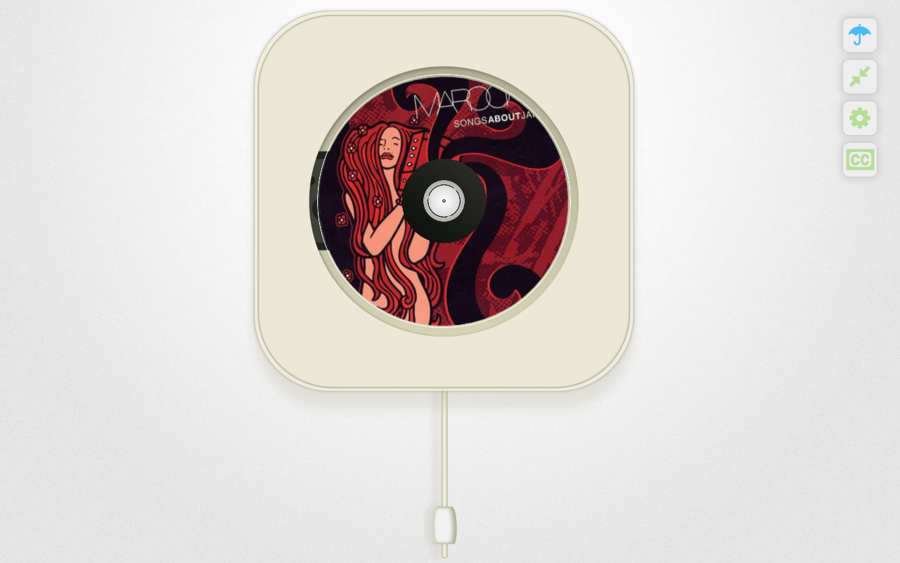
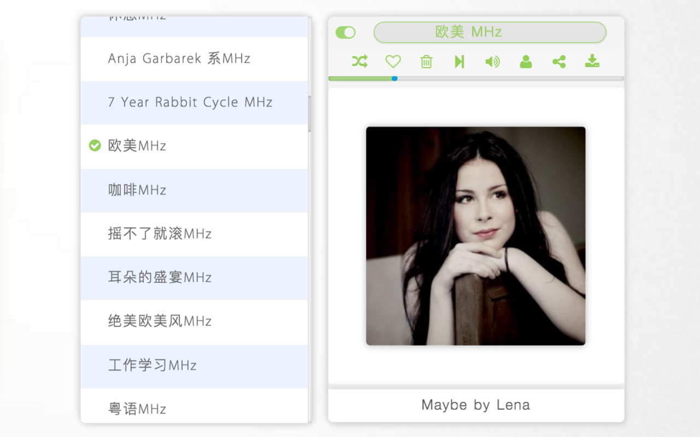

##豆瓣FM·新视觉 - New Player

`A real Player on web, used douban.com's API`

###Update History

ver: 1.2.1
    
    date: 2016-04-02
    * 修复部分歌曲到小站的链接
    * 修复用户设置bug
    
ver: 1.2.0
    
    date: 2016-03-20
    * 新增下载歌曲自动设置文件名
    * 新增页面title自动更新
    * 调整频道列表样式
    
ver: 1.1.0
    
    date: 2016-03-13
    * 添加广告过滤功能
    * 添加收听当前频道时可以关注其他频道的功能
    * 更新频道列表显示样式
    * 移除作者唱片的显示功能
    * 更改部分点击交互
    * 添加github菜单链接
    
ver: 1.0.2
    
    date: 2016-02-21
    * 微调部分视觉效果
    
ver: 1.0.1.3
    
    date: 2015-11-08
    * 修改通知中心的内容呈现方式
    * 对window系统下的字体显示效果改进

ver: 1.0.1
    
    date: 2015-10-30
    * 新增唱片专辑页面导向: 点击唱片可以跳转到豆瓣专辑信息页面

ver: 1.0.0
    
    date: 2015-10-24
    1.频道选择功能
    2.用户登录功能
    3.单曲循环功能
    4.喜爱加心功能
    5.垃圾桶功能
    6.下一曲切换功能
    7.音量控制功能
    8.歌曲下载功能
    9.歌词动态显示功能
    10.用户交互显示功能
    11.切歌通知功能

###ScreenShots

	
	
	
###Installation

Goole web store Installation: [link][1], Baidu pan: [link][2]

Give me 5 stars if you like it.

###Contribution
I *really* welcome contributions! Please feel free to fork and send pull requests when...

	*   You have an idea about how to improve this project.
	*   You have found or fixed a bug!
	
I'll test and integrate them when time permits.

###Help
If you have any idea to improve this project or any problem using it, please create an [issue][3].

###License
The MIT License (MIT) Copyright &copy; 2015-2016 Kyle Yang and [contributors][4].

Permission is hereby granted, free of charge, to any person obtaining a copy of this software and associated documentation files (the "Software"), to deal in the Software without restriction, including without limitation the rights to use, copy, modify, merge, publish, distribute, sublicense, and/or sell copies of the Software, and to permit persons to whom the Software is furnished to do so, subject to the following conditions:

The above copyright notice and this permission notice shall be included in all copies or substantial portions of the Software.

THE SOFTWARE IS PROVIDED "AS IS", WITHOUT WARRANTY OF ANY KIND, EXPRESS OR IMPLIED, INCLUDING BUT NOT LIMITED TO THE WARRANTIES OF MERCHANTABILITY, FITNESS FOR A PARTICULAR PURPOSE AND NONINFRINGEMENT. IN NO EVENT SHALL THE AUTHORS OR COPYRIGHT HOLDERS BE LIABLE FOR ANY CLAIM, DAMAGES OR OTHER LIABILITY, WHETHER IN AN ACTION OF CONTRACT, TORT OR OTHERWISE, ARISING FROM, OUT OF OR IN CONNECTION WITH THE SOFTWARE OR THE USE OR OTHER DEALINGS IN THE SOFTWARE.

[1]:https://chrome.google.com/webstore/detail/%E8%B1%86%E7%93%A3fm%C2%B7%E6%96%B0%E8%A7%86%E8%A7%89-fm-in-new-vision/iohkfdpdopboklgjdgcmjhlmmiainloc
[2]:http://pan.baidu.com/s/1eRXb8FS
[3]:https://github.com/vinkerz/douban-fm-vision/issues
[4]:https://github.com/vinkerz/douban-fm-vision/graphs/contributors

