##豆瓣FM·新视觉 - FM in New Vision

###参考了实体Player的设计，并结合豆瓣FM的API进行了重新设计。
	实现了豆瓣FM的基础功能，包括但不限于：
	
	1.频道的选择
	2.用户登录
	3.单曲循环
	4.喜爱加心
	5.垃圾桶
	6.下一曲切歌
	7.音量控制
	8.歌曲下载
	9.歌词动态显示
	10.用户的交互显示
	11.切歌桌面通知
	12.分享功能

###效果展示

截图第一波：

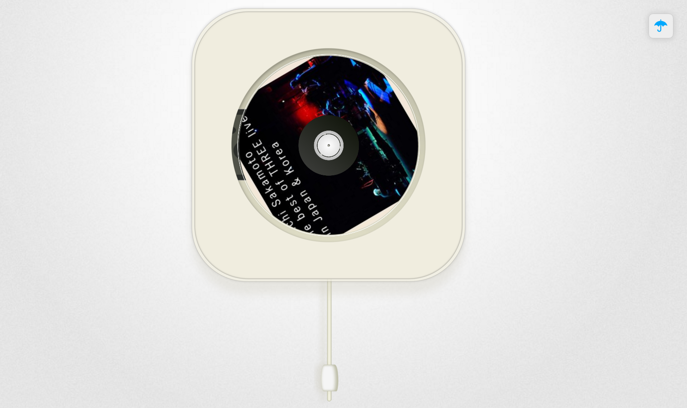
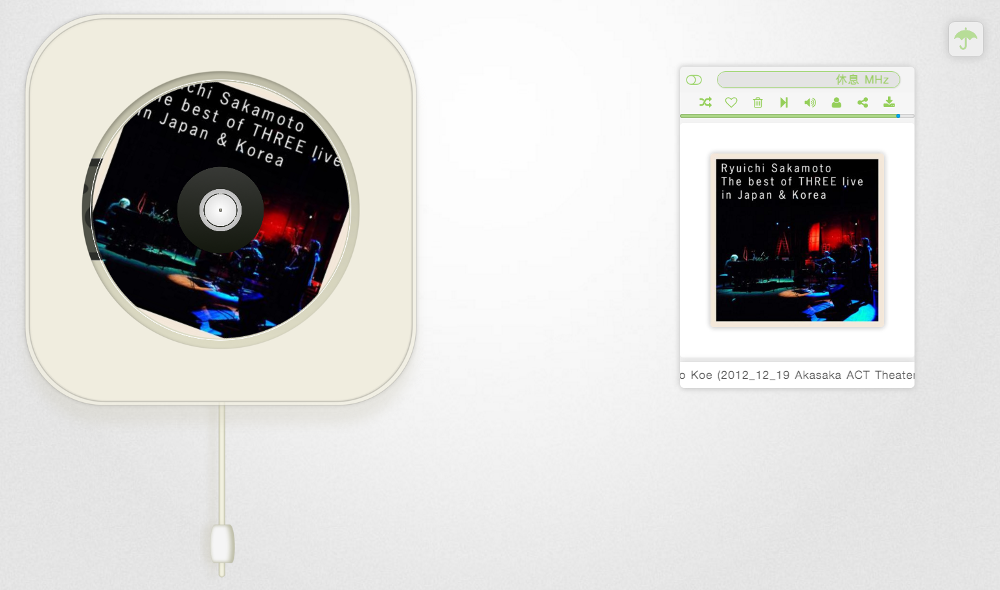
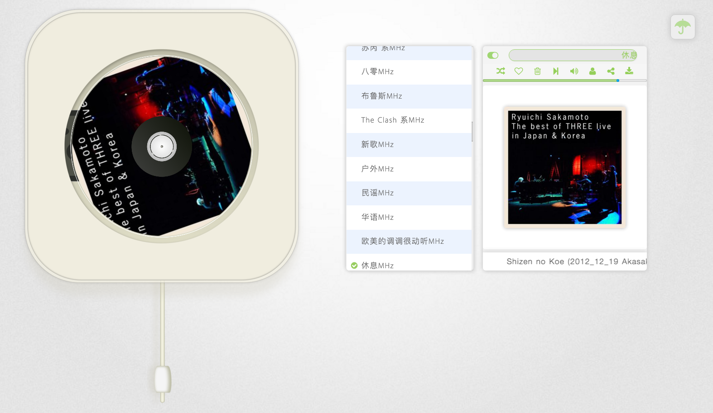
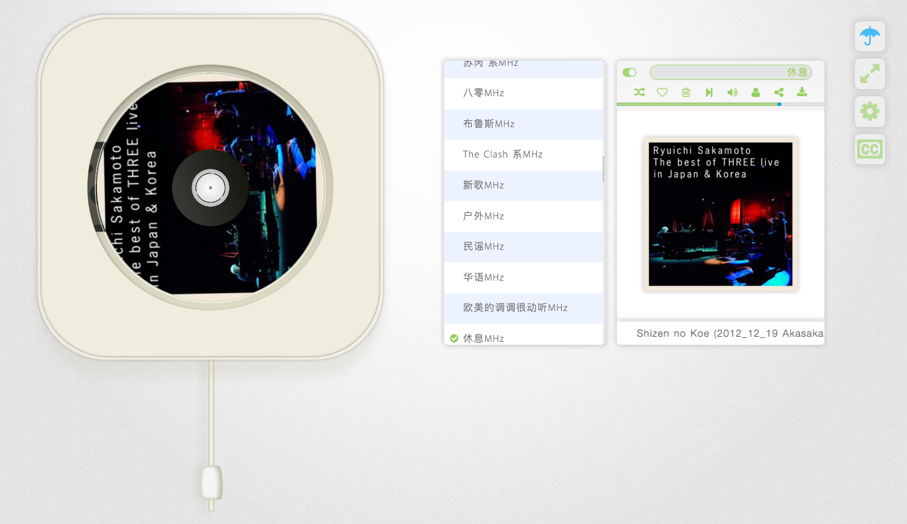
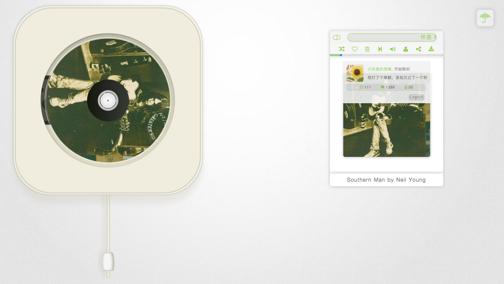
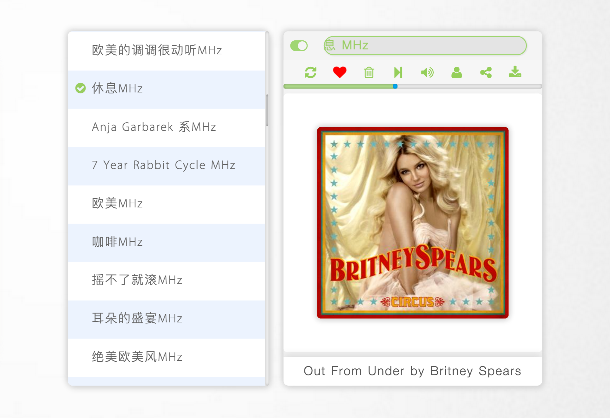
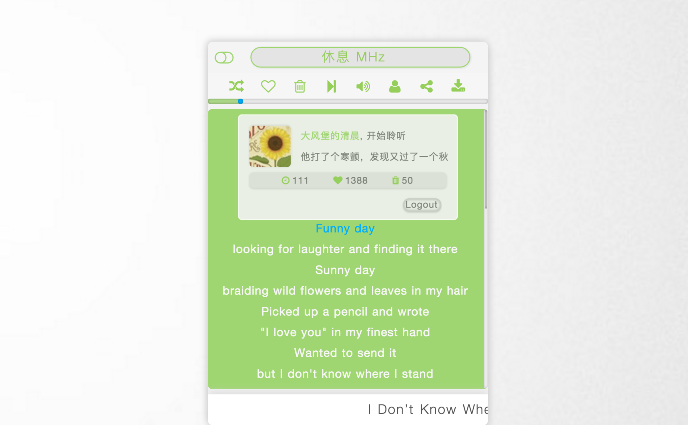
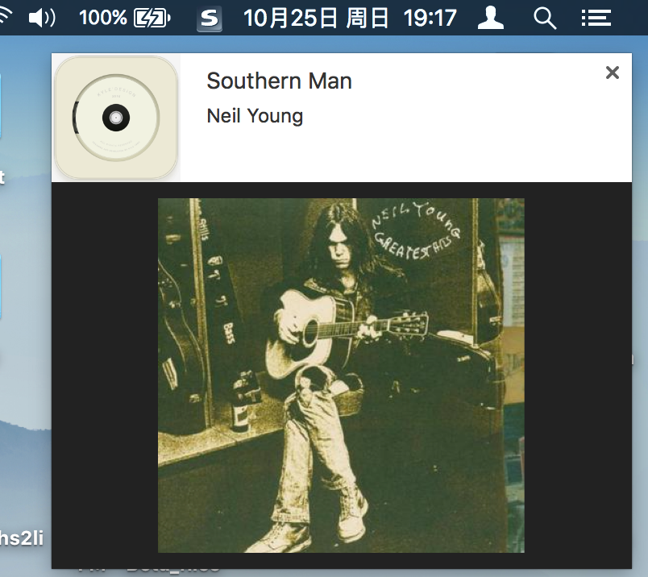
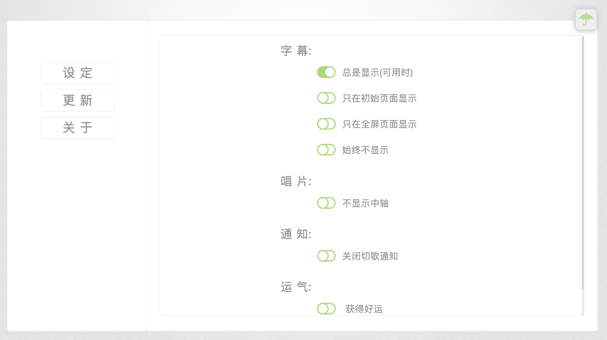
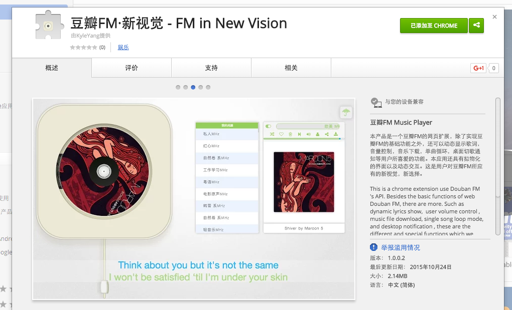

截图第二波：

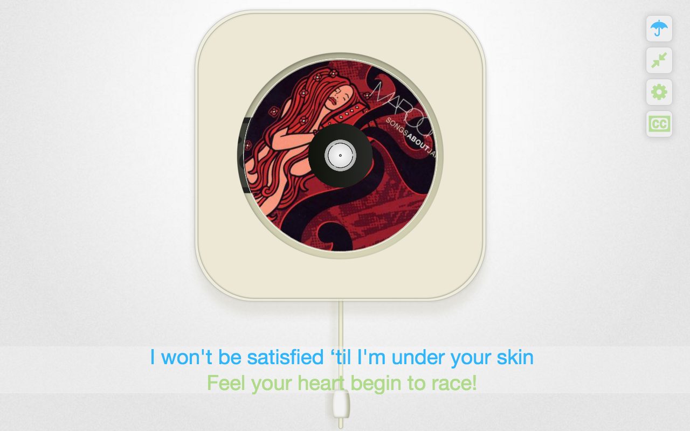
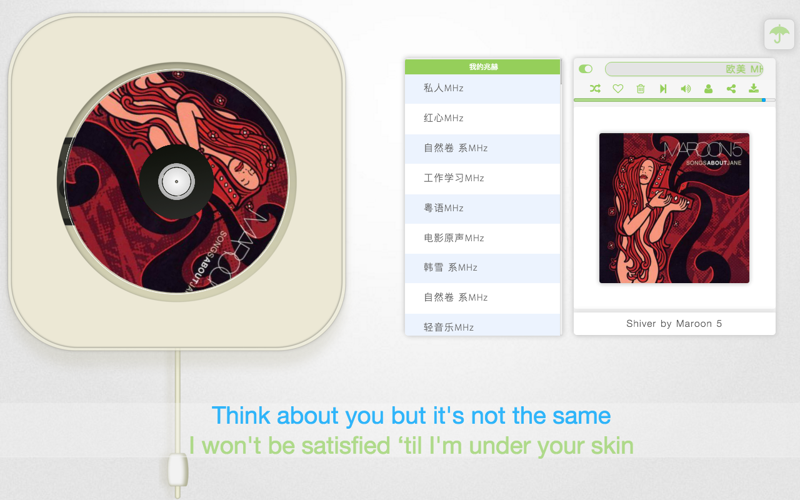
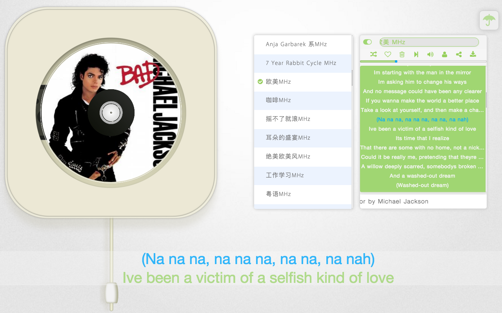

	
	
	
###安装方式
	豆瓣FM·新视觉 - FM in New Vision
	
Goole web store Install: [地址][1]
百度离线安装: [地址][2] 　

如果觉得不错，在商店上评价打分。

[1]:https://chrome.google.com/webstore/detail/%E8%B1%86%E7%93%A3fm%C2%B7%E6%96%B0%E8%A7%86%E8%A7%89-fm-in-new-vision/iohkfdpdopboklgjdgcmjhlmmiainloc
[2]:http://pan.baidu.com/s/1qW26lmW

